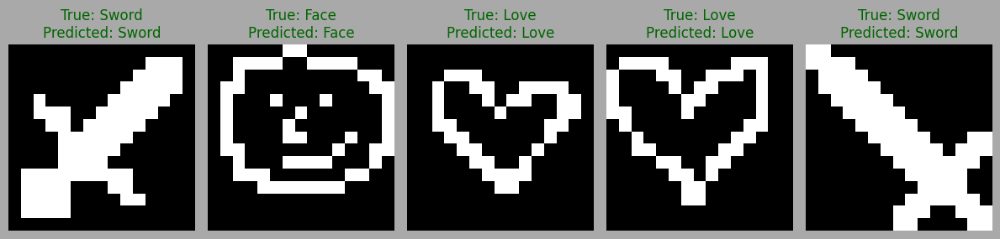
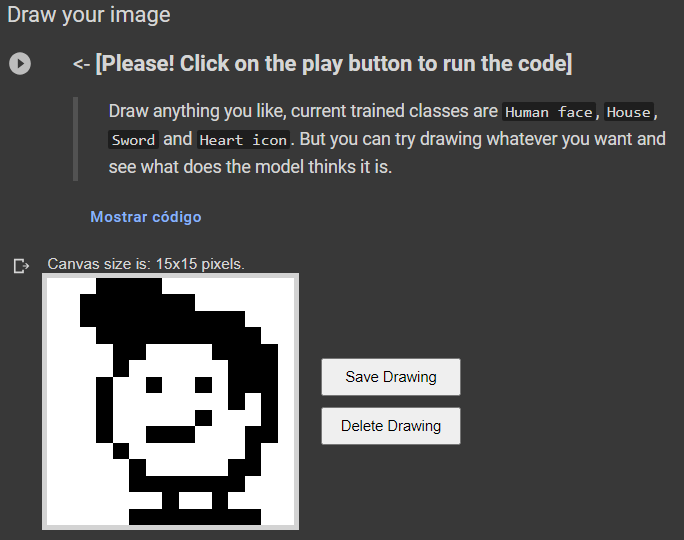
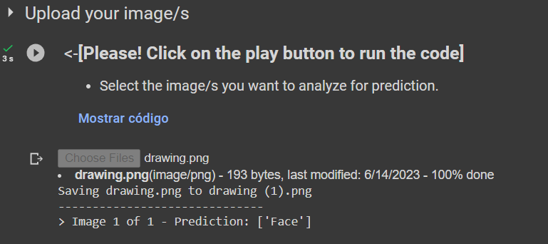

# Pixelated Handmade Drawings Classifier

Pixelated Handmade Drawings Classifier is a repository that contains a classifier designed to classify different types of pixelated drawings created by hand. It is based on a similar approach to MNIST but utilizes a dataset specifically crafted for this project.

> Please note that this repository was primarily created for testing purposes, and certain aspects might not be refined. The main objective was to develop a fully functional whiteboard in a google colab enviroment and demonstrate the model predictive capabilities based on the images drawn by the user.

---

# Dataset

The dataset used for training and testing the classifier has been made all by myself. In the [images folder](https://github.com/JonathanCruze/Drawings_Classificator/tree/main/images) there are various subfolders representing each class of simple drawings, such as: *House, Human face, Sword,* and *Heart* Each class subfolder contains multiple images of its corresponding type of drawing.

---

## Google Colaboratory Notebook

To explore the functionality of the classifier and gain hands-on experience, you can access via this [Google Colaboratory Notebook Link](https://colab.research.google.com/drive/1xgEADBafrzOMSwvCQqMF-iS-mI54hWad?usp=sharing). The notebook provides comprehensive guidance, including all the necessary data files pulled directly from this repository.

Feel free to delve into the notebook and leverage it to understand and experiment with the Pixelated Handmade Drawings Classifier.

## Interactive Whiteboard in Google Colaboratory

I've implemented an interactive Whiteboard feature in a [Google Colaboratory Notebook](https://colab.research.google.com/drive/1xgEADBafrzOMSwvCQqMF-iS-mI54hWad?usp=sharing) that I'm really proud of it. This feature enables users to unleash their creativity by crafting custom and intricate pixel-art images directly on the Whiteboard interface. 

What makes this Whiteboard even more special to me is the fact that it played a pivotal role in quickly creating in a fast-paced way the dataset that I used for training the model, and it also has the plus to add some kind of interactivity to the project.

Once you created your pixelated masterpieces, you can simply upload them into the code cell below and observe the model's interpretation of your artwork.

